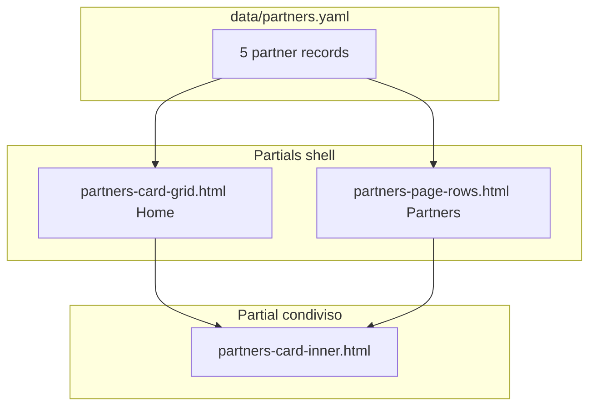

# FASE 8 — Riordino contenuti (Home, Project, Partners)

> **Versione:** 1.8 | **Data:** Aprile 2026  
> **Stato:** In corso — **Home (F8.A–C)** e **Project About (F8.D)** completate in codice; **F8.E** (Partners) specificata in dettaglio (implementazione codice in attesa di conferma).  
> **Branch:** develop

---

## Obiettivo

Riallineare il sito ai **mockup contenutistici** concordati in fase di progetto: per la **Home** (pilastri SES, What is DAMAGER, anteprima partner con LinkedIn); per la pagina **Project** / sezione «About the Project» (intro esteso, sei card sotto il blocco motore); per la pagina **Partners** / sezione «Our Partners» (layout e testi distinti dalla Home, contenuti dal mockup Partners concordato, vedi **F8.E**). I dettagli testuali e l’ordine dei blocchi seguono le **modifiche richieste e discusse** con il coordinamento (nessun riferimento a file o percorsi esterni in questo documento).

---

## Riferimenti

| Risorsa | Note |
|---------|------|
| Mockup contenuti Home | Testi e struttura concordati (pilastri, What is DAMAGER, partner) |
| Mockup contenuti Project — About | Testi e struttura concordati (intro About, sei card sotto il motore) |
| Project attuale | [`layouts/project/list.html`](../layouts/project/list.html) |
| Stili Project | [`assets/scss/_project.scss`](../assets/scss/_project.scss) |
| Drop-line motore | [`assets/js/main.js`](../assets/js/main.js) — `initEngineDroplines` |
| Home attuale | [`layouts/index.html`](../layouts/index.html) |
| Partners attuale | [`layouts/partners/list.html`](../layouts/partners/list.html) |
| Stili Home | [`assets/scss/_home.scss`](../assets/scss/_home.scss) |
| Stili Partners | [`assets/scss/_partners.scss`](../assets/scss/_partners.scss) |
| Stili card condivise (mixin rilievo) | [`assets/scss/_components.scss`](../assets/scss/_components.scss) — `card-base` |
| Partial pilastri | [`layouts/partials/home-pillars.html`](../layouts/partials/home-pillars.html) |
| Partial What is DAMAGER | [`layouts/partials/home-what-is-damager.html`](../layouts/partials/home-what-is-damager.html) |
| Dati partner (previsto) | [`data/partners.yaml`](../data/partners.yaml) — unica fonte per URL, logo, testi Home vs Partners (vedi **F8.E**) |
| Partial Home partner | [`layouts/partials/partners-card-grid.html`](../layouts/partials/partners-card-grid.html) — griglia multi-colonna; `sectionAlt` true |
| Partial Partners «Our Partners» | [`layouts/partials/partners-page-rows.html`](../layouts/partials/partners-page-rows.html) *(da creare)* — una card per riga; non riusare il markup della Home |
| Partial card singola *(previsto)* | [`layouts/partials/partners-card-inner.html`](../layouts/partials/partners-card-inner.html) — markup `.card-partner` condiviso, alimentato dal dato + variante `home` / `partners` |
| Immagine UAV Home | `static/images/home/uav-sweden-concept.webp` |
| Documento master indice fasi | [`PROGETTO_DAMAGER_WEBSITE.md`](PROGETTO_DAMAGER_WEBSITE.md) |

### Sintesi implementativa (Home)

- **Sfondi alternati** dopo l’hero: pilastri `section--alt` (grigio) → What is DAMAGER bianco → Our Partners `section--alt` sulla sola Home → timeline bianca → eventi `section--alt` → contact blueprint. La pagina **Partners** (`/partners`): sezione «Our Partners» con **layout dedicato** (una riga per partner), non la stessa sezione della Home — vedi **F8.E**.
- **Rilievo schede:** celle pilastri (`.home-pillars__cell`) e celle concetti (`.home-what-is__concept-cell`) usano `@include card-base` come le `.card-partner`.
- **What is DAMAGER:** nessun eyebrow (solo `<h2>`); **testo sopra l’immagine:** blocco intro a **larghezza piena** del contenitore (allineato all’immagine); prima frase in **`.home-what-is__intro-lead`** tutta in grassetto (`font-weight: 700`), dimensione intro `$font-size-lg`.
- **Partner card:** riga `.card-partner__footer` con *Visit website* a sinistra e *LinkedIn* a destra (`justify-content: space-between`).

### Sintesi specifica (Project — mockup About concordato)

- **Intro «About the Project»:** blocco **`.project-about-lead`** in [`layouts/project/list.html`](../layouts/project/list.html) — paragrafi con **`<strong>`** sulle frasi guida, due liste **`.project-about-lead__list`** (criticità e tecnologie abilitanti), paragrafo finale di chiusura; sostituisce la tagline unica storica (*Study of additive manufacturing…*).
- **Collegamenti motore → card (SVG):** linee tratteggiate generate da JavaScript dagli anchor alle card media. Coordinate **attuali** nel markup: `#dot-compressor` **`left: 17%; top: 70%`**, `#dot-combustor` **53% / 86%**, `#dot-turbine` **76% / 78%** (ritocchi futuri solo sugli `style` inline degli anchor).
- **Card sotto il motore:** **sei** `.about-card` con una sola **`<h3 class="about-card__title about-card__title--standalone">`** per cella (testo verbatim del mockup); griglia in `_project.scss` (1 colonna mobile, 2 da `md`, 3 da `lg`).

---

## F8.A — Home: tre pilastri (Scalability, Efficiency, Survivability)

**Posizione:** subito dopo la sezione Hero, prima di «What is DAMAGER».

**Contenuto (dal mockup Home concordato):**

- Titolo di sezione: **Scalability. Efficiency. Survivability.**
- Tre celle su una riga (responsive: colonna unica su mobile), ciascuna con:
  - titolo (Scalability / Efficiency / Survivability);
  - tagline in grassetto (testi concordati);
  - paragrafo descrittivo completo (testi concordati).

**Nota redazionale:** non pubblicare stringhe di appoggio presenti nei materiali di lavorazione (es. «Preso qui», «Add link to LinkedIn pages»).

---

## F8.B — Home: «What is DAMAGER»

**Eyebrow:** nessuno — il titolo `<h2>What is DAMAGER</h2>` è sufficiente; si evita il duplicato semantico con la sezione Project «About the Project».

**Ordine dei blocchi:**

1. Testo introduttivo dal mockup concordato (finanziamento EC / European Defence Fund, bisogni, paragrafi su swarm/larger UAV, ecc.). La **prima frase** è resa in grassetto intero (`.home-what-is__intro-lead`); il blocco intro ha la **stessa larghezza** dell’immagine sotto (full width del `.container`). Includere il blocco **«To answer these challenges…»** con le **quattro aree tecnologiche** (coppie titolo + continuazione «to improve…» / «to reduce…» / ecc.) e la chiusura su modellazione numerica e test sperimentali, come sul mockup.
2. **Immagine** (formato wide ~2:1).  
   - **Sorgente file:** `https://nextgendefense.com/wp-content/uploads/2025/12/uav-sweden-concept.webp`  
   - In repository: copiare l’asset sotto `static/images/home/` (nome stabile, es. `uav-sweden-concept.webp`) per indipendenza dal CDN esterno.  
   - **Non** mostrare alcun link di riferimento accanto all’immagine in pagina.
3. **Didascalia** sotto l’immagine (testo letterale concordato):  
   `Concept photo of GKN Aerospace’s UAV. Photo: GKN Aerospace`
4. **Nome esteso / acronimo DAMAGER:** stesso schema della hero (`hero__subtitle` con lettere evidenziate in `<strong>`), come in [`layouts/index.html`](../layouts/index.html) (classe `.home-what-is__acronym`).
5. **Griglia 8 concetti** (2 righe × 4 colonne da breakpoint `md`/`lg`; impilamento su mobile), testi esatti concordati:
   - Low-cost, high-performance turbojet propulsion for future UAV platforms  
   - Scalable solutions for mass deployment and rapid manufacturing  
   - Improved fuel efficiency and reduced specific fuel consumption  
   - Advanced additive manufacturing for shorter lead times and lower cost  
   - Reduced infrared signature for improved survivability  
   - Innovative combustion concepts for enhanced fuel flexibility  
   - Numerical and experimental validation of next-generation turbojet technologies  
   - Strategic support for future European autonomous air-power capabilities  

**Accessibilità:** un solo `<h1>` (logo in hero); queste sezioni usano `<h2>` / `<h3>` coerenti con il resto del sito.

---

## F8.C — Home: «Our Partners» + LinkedIn

**Markup di partenza:** stessa struttura della sezione *Partner Cards* in [`layouts/partners/list.html`](../layouts/partners/list.html) (eyebrow «Consortium Members», titolo «Our Partners», `card-grid`, cinque `card-partner`).

**Implementazione attuale (Home):** griglia in [`layouts/partials/partners-card-grid.html`](../layouts/partials/partners-card-grid.html), inclusa dalla Home con `sectionAlt` true.

**Evoluzione prevista (F8.E):** la pagina `/partners` **non** riuserà più lo stesso partial/layout della Home per «Our Partners»; resterà comune solo il **modello dati** (YAML) e, in implementazione, un partial **interno** per il corpo della singola card (vedi **F8.E**). Gli URL **LinkedIn** definiti qui sotto restano la fonte per entrambe le superfici.

**Aggiunta obbligatoria su ogni card:** link alla company page LinkedIn, `target="_blank"`, `rel="noopener noreferrer"` (stesso approccio del link LinkedIn nella contact card HIT09 sulla Home). Nella riga azioni (`.card-partner__footer`), **Visit website →** è allineato a sinistra e **LinkedIn** all’estrema destra (`flex` + `justify-content: space-between`).

| Partner | URL LinkedIn |
|---------|----------------|
| HIT09 SRL | https://www.linkedin.com/company/hit09-srl/ |
| LITHOZ GMBH | https://www.linkedin.com/company/lithoz/ |
| AENIUM ENGINEERING SL | https://www.linkedin.com/company/aenium-engineering/ |
| ERGON RESEARCH SRL | https://www.linkedin.com/company/ergon-research |
| COMOTI | https://www.linkedin.com/company/comoti-incdt/ |

---

## F8.D — Project page («About the project») — mockup About concordato

**Ambito:** modifiche richieste e discusse per la sezione About (testo introduttivo lungo + sei blocchi descrittivi sotto lo schema motore), da riflettere nel template senza citare percorsi o file sorgente esterni.

**Obiettivo:** aggiornare solo la prima sezione della pagina [`/project`](../layouts/project/list.html) (`About the Project` su `bg-blueprint`), lasciando invariate (salvo necessità redazionale futura) **Project Details**, **Timeline** e il resto del template.

### D1 — Introduttivo prima del blocco motore

- **Posizione:** tra il titolo `About the Project` e `<div class="engine-block">`.
- **Implementazione:** wrapper **`.project-about-lead`** in [`layouts/project/list.html`](../layouts/project/list.html) — paragrafi con **`<strong>`** sulle frasi guida, due **`<ul class="project-about-lead__list">`**, paragrafo finale senza grassetto; stili in `_project.scss` (larghezza piena del contenitore, allineata a griglia engine + `about-cards`; tipografia).
- **Sostituisce:** il vecchio `section-intro` a una riga (*Study of additive manufacturing for low-cost…*).

### D2 — Engine block e linee di collegamento

- Struttura: `engine-droplines` SVG + immagine `turbojet.png` + tre `.engine-anchor` con coordinate **inline** nel markup + tre `.gif-card` (compressor / combustor / turbine).
- **Anchor attuali** nel template: `#dot-compressor` **`left: 17%; top: 70%`**; `#dot-combustor` **`left: 53%; top: 86%`**; `#dot-turbine` **`left: 76%; top: 78%`**. Le drop-line sono disegnate da `initEngineDroplines()` in `main.js` a partire da questi punti.

### D3 — Griglia `about-cards` (sei contenuti)

- Rimuovere le quattro card tematiche storiche (Mission background, Critical gaps, Technologies, Programme goals).
- **Sei** `.about-card` con testo **verbatim** del mockup (ordine rispettato), senza prefisso numerico; una frase per cella in `<h3 class="about-card__title about-card__title--standalone">` con **`font-weight: 700`** (nessun `about-card__body` separato).
- **Layout (indicazione implementativa):** `.about-cards` con `grid-template-columns`: 1fr (base); da breakpoint `md` due colonne; da `lg` (o `xl`) tre colonne per ottenere due file da tre card sotto il blocco motore.

### File da toccare (implementazione)

| File | Modifica |
|------|----------|
| [`layouts/project/list.html`](../layouts/project/list.html) | `.project-about-lead`, anchor motore (incl. compressore 17%/70%), sei `about-card` |
| [`assets/scss/_project.scss`](../assets/scss/_project.scss) | Griglia `.about-cards`; `.gif-card` / `.about-card` con `@include card-base`; `about-card__title--standalone` |
| [`docs/SPECIFICHE_SITO.md`](SPECIFICHE_SITO.md) | § Project — About (allineato alla specifica F8.D) |

**Stato:** implementazione allineata al mockup in [`layouts/project/list.html`](../layouts/project/list.html) + [`assets/scss/_project.scss`](../assets/scss/_project.scss) — intro `.project-about-lead`, anchor come sopra, sei card standalone in grassetto, hover rilievo su `.gif-card` e `.about-card`.

---

## F8.E — Partners page: sezione «Our Partners» (distinta dalla Home)

> **Stato documentazione:** specifica e architettura sotto approvate come riferimento. **Implementazione Hugo/SCSS:** in attesa di **conferma esplicita** prima di modificare repository (partial, `data/`, `list.html`).

### Requisiti (mockup contenuti Partners concordato)

1. **Sezione diversa dalla Home** — La sezione «Our Partners» su `/partners` non deve essere il riuso dello stesso partial/layout della Home: markup e/o layout dedicati.
2. **Una riga per partner** — Ciascun partner occupa **un’intera riga** (griglia a colonna singola a tutti i breakpoint, nessuna griglia 2/3 colonne come sulla Home).
3. **Testi** — Ruolo e descrizione (e ogni altro testo previsto dal mockup) **verbatim** concordato; trascritti in un unico file dati (vedi sotto), campo dedicato alla variante **partners**.
4. **LinkedIn** — Stessi URL company già usati sulla Home (**F8.C**, tabella sotto); nessun nuovo arricchimento URL: si riallinea il markup Partners a questa tabella.

| Partner | URL LinkedIn |
|---------|----------------|
| HIT09 SRL | https://www.linkedin.com/company/hit09-srl/ |
| LITHOZ GMBH | https://www.linkedin.com/company/lithoz/ |
| AENIUM ENGINEERING SL | https://www.linkedin.com/company/aenium-engineering/ |
| ERGON RESEARCH SRL | https://www.linkedin.com/company/ergon-research |
| COMOTI | https://www.linkedin.com/company/comoti-incdt/ |

**Invariato:** intro consorzio in cima alla pagina, statistiche, mappa Leaflet (FASE 5 / FASE 7) salvo nuove indicazioni.

---

### Architettura consigliata (ordinata, DRY, mantenibile)

Obiettivo: **un solo posto** per sito, LinkedIn, logo, paese, flag; **due testi** dove serve (anteprima Home vs copy completo su Partners); **due shell** di pagina (griglia vs righe) che delegano a un **unico** partial per il corpo della card.



| Componente | Ruolo |
|------------|--------|
| **`data/partners.yaml`** | Lista ordinata di partner. Campi minimi suggeriti: `id`, `name`, `country_label`, `flag` (path SVG), `coordinator` (bool), `role_home`, `role_partners` *(se il mockup unifica ruolo+descrizione, un solo campo `role_partners` + `description_partners`)*, `description_home`, `description_partners`, `website`, `linkedin`, `logo`, `logo_alt`. I testi **Partners** devono riflettere il **mockup Partners** concordato; i testi **Home** possono restare più brevi finché il mockup Home non li aggiorna. |
| **`partners-card-inner.html`** | Riceve un dizionario (es. `partner` + `variant` = `home` \| `partners`). Renderizza struttura `.card-partner` (logo, paese, nome, ruolo, descrizione in base alla variante, footer con Visit website + LinkedIn). Nessuna duplicazione delle cinque card in HTML lungo. |
| **`partners-card-grid.html`** | Solo Home: `<section>`, eyebrow/titolo, wrapper **`.card-grid`** (comportamento attuale multi-colonna), `range` su `site.Data.partners`, per ogni elemento chiama `partners-card-inner` con `variant: home`. Parametro `sectionAlt` invariato. |
| **`partners-page-rows.html`** | Solo Partners: `<section>` con sfondo bianco come oggi, eyebrow/titolo allineati al mockup Partners concordato, wrapper **`.card-grid.card-grid--partners-page`** (o classe dedicata in `_partners.scss`) con **`grid-template-columns: 1fr`** a tutti i breakpoint, `range` sugli stessi dati, `partners-card-inner` con `variant: partners`. |
| **`layouts/partners/list.html`** | Sostituire l’inclusione attuale di `partners-card-grid.html` con `partners-page-rows.html`. |
| **SCSS** | In [`assets/scss/_partners.scss`](../assets/scss/_partners.scss) (o `_components.scss`): modificatore **`.card-grid--partners-page`** che forza 1 colonna e annulla le media query multi-colonna di [`.card-grid`](../assets/scss/_components.scss). Opzionale: layout orizzontale logo+testo da un breakpoint se il mockup lo richiede. |

**Schema YAML di esempio** (indicativo; adattare ai campi reali del mockup Partners):

```yaml
partners:
  - id: hit09
    name: "HIT09 SRL"
    coordinator: true
    country_label: "Italy"
    flag: "/images/flags/it.svg"
    role_home: "Project Coordinator"
    description_home: "…"
    role_partners: "…"
    description_partners: "… testo Partners (mockup concordato) …"
    website: "https://www.hit09.com/advanced-design"
    linkedin: "https://www.linkedin.com/company/hit09-srl/"
    logo: "/images/partners/hit09.png"
    logo_alt: "HIT09 SRL logo"
  # … altri 4 partner
```

**Ordine di implementazione suggerito** (dopo conferma): (1) creare `data/partners.yaml` migrando i contenuti attuali da `partners-card-grid.html`; (2) estrarre `partners-card-inner.html`; (3) refactor `partners-card-grid.html` a `range`; (4) aggiungere `partners-page-rows.html` + SCSS; (5) aggiornare `layouts/partners/list.html`; (6) compilare `description_partners` / ruoli dal mockup Partners concordato; (7) build Hugo e controllo accessibilità.

---

## Ordine sezioni Home (risultato atteso)

```
Hero
  → Tre pilastri (SES)
  → What is DAMAGER
  → Our Partners (partial + LinkedIn)
  → Project Timeline / progress bar
  → Upcoming Events
  → Contact
```

---

## Checklist implementazione

- [x] **F8.1** Sezione tre pilastri in Home (markup + testi concordati)  
- [x] **F8.2** Sezione What is DAMAGER: testi, immagine da `.webp` in `static/images/home/`, didascalia, acronimo, griglia 8  
- [x] **F8.3** Partial `partners-card-grid.html` + link LinkedIn su tutte e 5 le card; inclusione Home (e Partners fino a separazione **F8.E**)  
- [x] **F8.4** Stili in `_home.scss` (pilastri, figura+didascalia, griglia 8); ritocchi `card-partner` in `_components.scss`  
- [x] **F8.5** Verifica build Hugo, responsive, heading hierarchy  
- [x] **F8.6** Specifica **F8.D** (Project — mockup About): intro `.project-about-lead`, sei `about-card`, coordinate anchor (compressore 17%/70%) — documentata in questo file e in `SPECIFICHE_SITO.md`  
- [x] **F8.7** Implementazione codice pagina Project secondo **F8.D** (intro `.project-about-lead`, 6 card, griglia SCSS)  
- [x] **F8.E-spec** Specifica **F8.E**: Partners «Our Partners» distinta dalla Home, una riga per partner, testi mockup Partners concordato, architettura `data/partners.yaml` + partial (documentato qui e in `SPECIFICHE_SITO.md`)  
- [ ] **F8.E-code** Implementazione codice **F8.E** (`data/partners.yaml`, `partners-card-inner`, `partners-page-rows`, refactor griglia Home, SCSS) — **in attesa di conferma**  

---

## Rinumera fasi successive (contesto)

Con l’introduzione di questa FASE 8, nel documento master **Deploy e Go-Live** diventa **FASE 9** e **Formazione editor** diventa **FASE 10**. I file markdown dedicati andranno nominati di conseguenza al momento della creazione (es. `FASE_9_Deploy.md`, `FASE_10_Formazione.md`).

---

*FASE 8 — Riordino contenuti | DAMAGER Website v1.9 | Aprile 2026*
